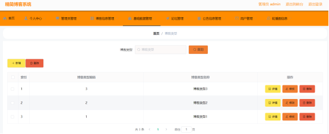

# 基于Springboot的精简博客系统的设计与实现-优秀毕业设计

<h4 style='color:red'>联系不到我，就看我的主页 </h4> 
 
#### 系统概要

本博客系统是基于Spring Boot框架开发的一个集内容管理、用户交互与信息共享于一体的精简型平台。该系统旨在为用户提供一个便捷、高效的博客创作与分享环境，同时，通过细化的权限管理，为管理员提供全面的后台管理能力，确保系统的有序运行与内容的优质呈现。系统采用了前后端分离的设计模式，前端使用现代JavaScript框架构建响应式界面，后端则依托Spring Boot强大的RESTful API支持，实现了高内聚低耦合的系统架构。

#### 研究背景

近年来，第三产业发展非常迅速，诸如计算机服务、旅游、娱乐、体育等服务行业，对整个社会的经济建设起到了极大地促进作用，这一点是毋庸置疑的。现下，国家也出台了一些列的政策来支持和鼓励第三服务产业的发展与完善，用以带动社会经济的发展[1]。所以，整体来说，国家是比较提倡发展第三方服务行业的。纵观计算机领域的整个发展历程，从计算机的诞生到现在，已经有几百年的历史了，计算机应用技术也逐步趋于成熟，并且相关的设计人员也在不断地对其进行改进和完善。再到如今，计算机已经发展成为一个比较热门的行业了。在高校中，计算机、人工智能等专业热度非常高，许多学生在选择专业的时候，大都优先考虑计算机专业。在社会上，计算机类行业也成为了比较受欢迎的行业，从在浏览器中访问的网址，到手机上的各种应用程序，到大型的软件服务设备，基本上都离不开计算机技术支持，以及硬件的支撑。
如今，互联网几乎遍布于世界的各个角落，人工智能、大数据占据的越来越重要的社会地位，比如疫情期间，通过大数据技术进行筛查，确定哪些人员无接触史，哪些人员需要重点观察，由此可以在极短的时间内，以最快的速度对疫情进行防控。在这个大背景环境的推动下，本人通过学习Java语言、MySQL数据库、SSM框架等相关的计算机技术，打好坚实的技术基础，方便后期对系统进行研发。而后再通过对系统进行需求分析、可行性分析、总体功能设计等工作准备，确定系统的总体功能需求，方便接下来详细地系统功能模块进行设计和实现，最后成功的研发了一款基于Springboot开发的精简博客系统。本系统改善了传统的管理模式，将原先的手工记录和管理信息，改进为使用计算机存储和管理信息记录，极大地方便了工作人员对相关数据进行处理，为企业节约了不少的员工费用和管理开销，并且能够在较短的时间内响应用户的需求，这种便捷的操作，对于用户来说可以节省了不少时间和精力，也省去了不少的麻烦，极大了方便了用户。

#### 国内外研究现状

##### 国外研究现状

美国是最先发展计算机技术的众多国家之一，早在上个世纪，美国就快速的将计算机技术发展起来，并且将其运用在军事、医院、学校、社会服务等场所。日本、德国等国家紧随其后，不断地发展和完善计算机技术，侧重将医疗、社会服务等领域与计算机技术相结合。而后随着社会的发展与进步，计算机技术逐渐趋于成熟。许多发达国家在探索将计算机技术应用于各行各业中时，从另一个角度来看，也在不断地推进企业的信息化管理进程，使得企业管理也变得更加网络化、信息化了。有许多专家表示，可以结合使用图像处理软件、人工智能技术等相关工具，深度地分析博客管理系统，主要从简化运行操作，加设功能模块，美化系统界面，保障数据安全等方面，更深层次地提升和优化系统，并且尽可能地在理想状态下做到实时的信息共享。

##### 国内研究现状

国内的计算机技术的发展虽然晚于国外，尤其是美国、英国、德国等发达国家。但是我国的计算机技术发展势头非常迅猛，近些年，也逐渐走向成熟和完善的阶段。现在，选择网上购物已经成为人们日常生活的一种常态趋势，当然这也离不开对于天猫、支付宝、微信等应用软件的使用。许多企业结合使用了云计算、人工智能等先进的计算机技术，自主研发了行业相关的信息管理系统，使得计算机技术越来越成熟，系统功能越来越完备。结合计算机技术，采用主流的B/S开发结构模式开发一款基于Springboot开发的精简博客系统。由此，本系统能够支持工作人员随时随地的通过使用浏览器进行访问操作，支持随时随地对相关的博客信息进行管理，便于及时为用户提供一定的功能服务。并且所设计的系统基本上能够符合用户的客观使用需求，有利于充分协调企业的人力、财力、物力等资源，不断提高企业管理质量和水平。

#### 技术栈

后端技术栈：Springboot+Mysql+Maven

前端技术栈：Vue+Html+Css+Javascript+ElementUI

开发工具：Idea+Vscode+Navicate

#### 系统功能介绍

管理员角色功能模块  
个人中心：管理员可以查看并编辑自己的个人信息，包括账号安全设置、操作日志查看等。  
基础数据管理：负责系统基础数据的配置与维护，如分类管理、标签管理等。  
论坛管理：管理论坛版块、帖子与评论，具备审核、删除、置顶等功能。  
公告管理：发布、编辑与删除系统公告，通知所有用户重要信息。  
老师管理：针对教育类博客，管理教师信息，支持教师资料审核与权限分配。  
实习管理：包括实习岗位发布、学生申请审核、实习进度跟踪等功能。  
实习成绩管理：记录并管理学生的实习成绩，支持成绩录入、查询与导出。  
实习分享管理：审核并展示学生的实习心得分享，促进经验交流。  
实习周报管理：学生提交实习周报，管理员进行审阅与反馈。  
学生管理：学生信息管理，包括基本信息、学习进度等。  
轮播图信息管理：管理首页轮播图，提升系统视觉吸引力和信息展示效果。  

用户角色功能模块  
博客信息：浏览、搜索与发布博客文章，支持文章编辑、删除与分享。  
论坛：参与论坛讨论，发表帖子与评论，与其他用户交流。  
公告信息：查看系统公告，获取重要通知与活动信息。   
个人中心：管理个人资料、密码、收藏夹等，查看个人博客列表与统计信息。  
后台管理（针对高级用户或特定授权）：  
博客信息管理：高级用户可对自己的博客文章进行更细致的管理，如批量编辑、数据分析等。  
论坛管理：在授权范围内，管理自己创建的论坛版块或帖子。  
公告信息管理：特定用户可协助发布或编辑公告信息。  

#### 系统的总体功能设计

系统的总体功能设计，是需求分析的下一个阶段，是系统实现的上一个阶段，它是系统详细功能设计的一个大方向，也就是说系统的各类子功能模块的设计，都是以总体功能设计为目标而进行的。通过对系统进行需求分析可知，可以大致了解系统具体所需要的相关功能。本系统主要的功能需求包括用户信息管理、博客信息管理、论坛信息管理等模块。

#### 系统作用

本系统通过精细化的角色划分与功能模块设计，不仅为用户提供了一个简洁高效的博客创作与分享平台，还大大提升了管理员对系统内容的监管能力。对于用户而言，系统降低了使用门槛，提升了创作与交流的便利性；对于管理员而言，则通过强大的后台管理工具，实现了对系统内容的全面掌控与高效管理。此外，系统还支持灵活的扩展与定制，能够根据不同场景的需求进行快速调整与优化。

#### 系统功能截图

个人中心

通过设计的个人中心管理功能模块，管理用户可以对相关的个人信息进行管理，比如管理用户可以更新个人账号的密码信息，修改个人账号的用户名信息等，修改密码界面设计

管理员管理

通过设计的管理员管理功能模块，管理用户可以管理相关的管理员信息资料，比如进行查看管理员的用户名，更新管理员的密码信息，删除已经注销的管理员信息记录等操作。

用户管理

通过设计的员工管理功能模块，管理用户可以管理相关的用户信息资料，比如进行查看用户姓名，修改用户联系方式，删除已经注销的用户信息记录等操作

基础数据管理

通过设计的基础数据管理功能模块，管理用户可以对相关的博客类型、帖子类型、公告类型信息进行管理，比如管理用户可以查看博客类型、帖子类型、公告类型的详情信息，删除失效的博客类型、帖子类型、公告类型信息记录等。

博客信息管理

通过设计的博客信息管理功能模块，管理用户可以对相关的博客信息进行管理，比如管理用户可以查看博客内容信息，删除已经失效的博客信息记录等操作。

博客评论管理

通过设计的博客评论信息管理功能模块，管理用户可以对相关的博客评论信息进行管理，比如管理用户可以查看博客评论内容信息，删除已经失效的博客评论信息记录等操作。

博客收藏管理

通过设计的博客收藏管理功能模块，管理用户可以对相关的博客收藏信息进行管理，比如管理用户可以查看博客收藏时间信息，删除已经失效的博客收藏信息记录等操作。

论坛管理

通过设计的论坛管理功能模块，管理用户可以对相关的论坛信息进行管理，比如管理用户可以查看论坛的帖子内容信息，删除已经失效的论坛信息记录等操作。

公告信息管理

通过设计的公告信息管理功能模块，管理用户可以对相关的公告信息进行管理，比如管理用户可以查看公告时间信息，删除已经失效的公告信息记录等操作。

轮播图管理

通过设计的轮播图管理功能模块，管理用户可以对相关的轮播图信息进行管理，比如管理用户可以查看轮播图名称信息，删除已经失效的轮播图信息记录等操作。

#### 总结

本研究在深入分析当前博客系统存在问题的基础上，设计并实现了一个基于Spring Boot的精简博客系统。该系统通过明确的功能模块划分与精细的权限管理，有效解决了传统博客系统在功能复杂性与管理灵活性方面的不足。系统不仅提升了用户的使用体验，还为管理员提供了强大的后台管理工具，确保了系统的有序运行与内容的优质呈现。未来，我们将继续关注用户需求与技术发展，不断优化系统功能，提升系统性能，为用户提供更加优质的服务体验。

#### 使用说明

创建数据库，执行数据库脚本 修改jdbc数据库连接参数 下载安装maven依赖jar 启动idea中的springboot项目

前台登录页面
http://localhost:8080/jingjianbokexitong/front/index.html

后台登录页面
http://localhost:8080/jingjianbokexitong/admin/dist/index.html

管理员				账户:admin 		密码：admin

用户				账户:a1 		密码：123456
